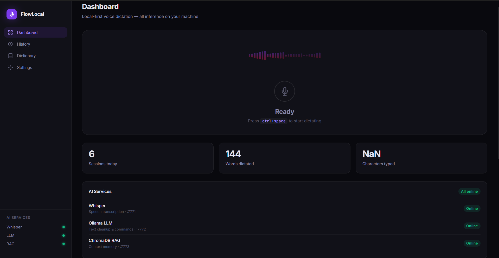

# FlowLocal 🎙️



A production-grade, local-first voice dictation application modeled after Wispr Flow. Everything runs entirely on your local machine using Ollama and Whisper.

**No Cloud APIs. No Telemetry. No Subscriptions.**

## System Architecture

```text
┌──────────────────────────────────────────────────────────────────────┐
│                          FlowLocal Desktop App                        │
│                                                                        │
│  ┌─────────────────────────────────────────────────────────────────┐  │
│  │                    Tauri 2 Shell (Rust)                          │  │
│  │                                                                   │  │
│  │  ┌──────────────────┐    ┌───────────────────────────────────┐  │  │
│  │  │  React Frontend  │◄──►│      Rust Core Backend            │  │  │
│  │  │  (TypeScript)    │    │                                   │  │  │
│  │  │                  │    │  ┌─────────────────────────────┐  │  │  │
│  │  │  • Overlay UI    │    │  │  hotkey_manager             │  │  │  │
│  │  │  • Settings      │    │  │  audio_capture              │  │  │  │
│  │  │  • Dictionary    │    │  │  text_injector              │  │  │  │
│  │  │  • Live Preview  │    │  │  ipc_bridge                 │  │  │  │
│  │  │  • History       │    │  │  context_detector           │  │  │  │
│  │  │  • System Tray   │    │  │  settings_store             │  │  │  │
│  │  │                  │    │  │  db_manager                 │  │  │  │
│  │  └──────────────────┘    │  └─────────────────────────────┘  │  │  │
│  │                          └───────────────────────────────────┘  │  │
│  └─────────────────────────────────────────────────────────────────┘  │
│                                    │                                   │
│                     Unix Socket / Named Pipe IPC                       │
│                                    │                                   │
│  ┌─────────────────────────────────▼───────────────────────────────┐  │
│  │                    Python AI Microservices                        │  │
│  │                                                                   │  │
│  │  ┌──────────────────┐    ┌──────────────────┐                   │  │
│  │  │  Whisper Service │    │   LLM Service    │                   │  │
│  │  │  (faster-whisper)│    │  (Ollama bridge) │                   │  │
│  │  │  • transcribe()  │    │  • cleanup()     │                   │  │
│  │  │  • stream()      │    │  • command()     │                   │  │
│  │  │  • VAD filter    │    │  • format()      │                   │  │
│  │  └──────────────────┘    └──────────────────┘                   │  │
│  │                                                                   │  │
│  │  ┌──────────────────┐    ┌──────────────────┐                   │  │
│  │  │   RAG Service    │    │  Dictionary Svc  │                   │  │
│  │  │  (ChromaDB)      │    │  (SQLite)        │                   │  │
│  │  │  • store()       │    │  • apply()       │                   │  │
│  │  │  • retrieve()    │    │  • learn()       │                   │  │
│  │  │  • embed()       │    │  • export()      │                   │  │
│  │  └──────────────────┘    └──────────────────┘                   │  │
│  └─────────────────────────────────────────────────────────────────┘  │
│                                    │                                   │
│                            Ollama HTTP API                             │
│                          (localhost:11434)                             │
└──────────────────────────────────────────────────────────────────────┘
```

## Data Flow

### Primary Flow: Voice → Text → Inject

```text
User Presses Hotkey
       │
       ▼
[Rust] hotkey_manager::on_press()
       │
       ├──► Emit Tauri event: "recording:start"
       │         │
       │         ▼
       │    [React] Overlay appears + waveform starts
       │
       ▼
[Rust] audio::capture::start_stream()
       │ (WASAPI on Windows / ALSA on Linux)
       │
       ▼ PCM chunks (16kHz, mono, f32)
       │
       ▼
[Rust] ipc::bridge::send_audio_chunk(chunk)
       │ (Unix socket / named pipe)
       │
       ▼
[Python] whisper/vad.py::process_chunk()
       │
       ├──► If speech detected → buffer
       ├──► If silence threshold → flush
       │
       ▼
[Python] whisper/transcriber.py::transcribe(buffer)
       │ (faster-whisper, CTranslate2, GPU if available)
       │
       ▼ raw_text: "uh hello um i wanted to..."
       │
       ▼
[Python] rag/store.py::retrieve_context(raw_text)
       │ (similar past corrections from ChromaDB)
       │
       ▼
[Python] llm/cleaner.py::clean(raw_text, context)
       │ (Ollama: qwen3:4b)
       │
       ▼ cleaned_text: "Hello, I wanted to..."
       │
       ▼
[Python] llm/formatter.py::format(cleaned_text, app_context)
       │ (context-aware formatting)
       │
       ▼ final_text
       │
       ▼
[Rust] ipc::bridge::on_text_ready(final_text)
       │
       ├──► Emit Tauri event: "text:ready" → React shows preview
       │
       ▼
[Rust] inject::text_injector::insert(final_text)
       │ (SendInput / xdotool)
       │
       ▼
Text appears in active application ✓
       │
       ▼
[Rust] db::manager::save_session(raw, cleaned, app, ts)
[Python] rag/store.py::store_correction(raw, cleaned)
```

### Command Mode Flow

```text
User says: "rewrite professionally [text]"
       │
       ▼
[Python] whisper::transcribe()
       │
       ▼ raw: "rewrite professionally hello can we talk"
       │
       ▼
[Python] commander.py::detect_command(raw)
       │
       ├── command: "rewrite_professional"
       └── content: "hello can we talk"
       │
       ▼
[Python] commander.py::execute(command, content)
       │ (Ollama prompt template)
       │
       ▼ "Hello, could we schedule a conversation?"
       │
       ▼
[Rust] inject::insert(result)
```

---

## 🛠️ Local Development Setup

To run FlowLocal from source, you need Node.js, Rust, and Ollama installed.

### 1. Prerequisites
* [Node.js (v18+)](https://nodejs.org/)
* [Rust & Cargo](https://rustup.rs/)
* [uv](https://github.com/astral-sh/uv) (Python package manager: `pip install uv`)
* [Ollama](https://ollama.com/)

### 2. Bootstrap the Environment

Run the setup script from the root directory. This will install frontend dependencies, create a Python virtual environment, install Python packages, and download the necessary AI models.

```powershell
# On Windows
.\setup_dev.ps1
```

### 3. Run the App

The Rust backend is configured to automatically launch the Python AI services when it starts. You only need to run the Tauri dev command:

```bash
cd apps/desktop
npm run tauri dev
```

---

## ⚙️ How it Works

1. **Press to Toggle:** Press the global hotkey (default: `Ctrl+Space` or `Cmd+Space`) once while focused on any application (VS Code, Chrome, Slack, etc.) to start capturing. Press it again to stop.
2. **Speak:** FlowLocal captures audio directly from your microphone. A floating overlay will show real-time partial transcription.
3. **Release:** The audio is sent to the Whisper service.
4. **Cleanup:** The raw transcript is passed to the LLM service to remove fillers and fix grammar, using context from the active application.
5. **Injection:** The polished text is instantly typed into your focused application using simulated keystrokes.

---

## 🧠 Managing the AI Models

FlowLocal uses [Ollama](https://ollama.com/) for text processing and embedding. By default, the setup script pulls `qwen2.5:3b` for fast cleanup, and `nomic-embed-text` for RAG memory.

To change the LLM model used for text cleanup, download a new model and change the setting in the FlowLocal UI:
```bash
ollama pull llama3.2:3b
```

Whisper models (for speech-to-text) are downloaded automatically on the first run. The default is `base`. If you have a powerful NVIDIA GPU, change this to `small` or `medium` in the settings for higher accuracy.

---

## Repository Structure

```text
flowlocal/
├── .github/
│   └── workflows/
│       ├── ci.yml
│       ├── release-windows.yml
│       └── release-linux.yml
│
├── apps/
│   └── desktop/                        # Tauri 2 app root
│       ├── src-tauri/                  # Rust backend
│       │   ├── Cargo.toml
│       │   ├── tauri.conf.json
│       │   ├── build.rs
│       │   └── src/
│       │       ├── main.rs
│       │       ├── lib.rs
│       │       ├── hotkey/
│       │       ├── audio/
│       │       ├── inject/
│       │       ├── context/
│       │       ├── ipc/
│       │       ├── db/
│       │       ├── settings/
│       │       ├── tray/
│       │       └── commands/           # Tauri IPC commands
│       │
│       └── src/                        # React frontend
│           ├── index.html
│           ├── main.tsx
│           ├── App.tsx
│           ├── components/
│           ├── hooks/
│           ├── stores/
│           ├── services/
│           └── styles/
│
├── services/
│   ├── whisper/                        # faster-whisper microservice
│   │   ├── pyproject.toml
│   │   ├── Dockerfile
│   │   └── src/
│   │
│   ├── llm/                            # Ollama LLM microservice
│   │   ├── pyproject.toml
│   │   ├── Dockerfile
│   │   └── src/
│   │
│   ├── rag/                            # ChromaDB RAG microservice
│   │   ├── pyproject.toml
│   │   ├── Dockerfile
│   │   └── src/
│   │
│   └── shared/                         # Shared Python utilities
│       ├── pyproject.toml
│       └── src/
│
├── data/
│   ├── models/                         # Whisper model cache
│   ├── chroma/                         # ChromaDB vector store
│   └── db/                             # SQLite databases
│
├── scripts/
│   ├── install.ps1                     # Windows install script
│   ├── install.sh                      # Linux install script
│   ├── dev.ps1                         # Windows dev runner
│   ├── dev.sh                          # Linux dev runner
│   ├── build.ps1                       # Windows build
│   ├── build.sh                        # Linux build
│   ├── setup-ollama.ps1
│   └── setup-ollama.sh
│
├── docker/
│   ├── docker-compose.yml
│   ├── docker-compose.dev.yml
│   └── Dockerfile.services
│
├── docs/
│   ├── architecture.md
│   ├── development.md
│   ├── deployment.md
│   └── api.md
│
├── .env.example
├── .gitignore
├── README.md
└── CONTRIBUTING.md
```
